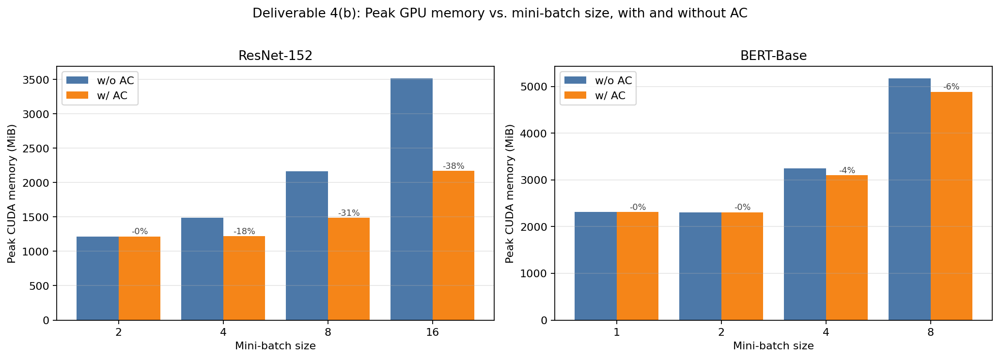
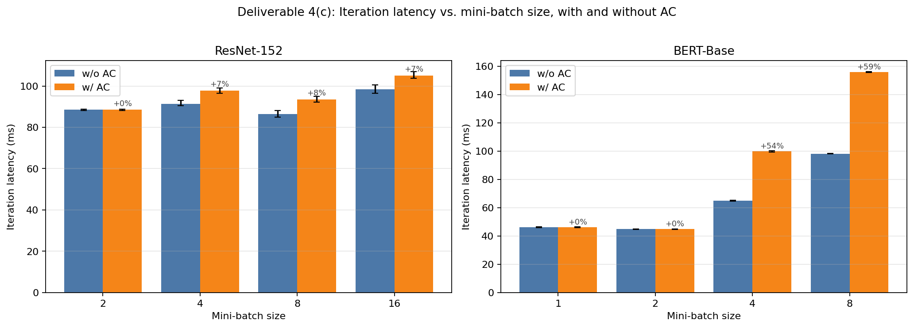
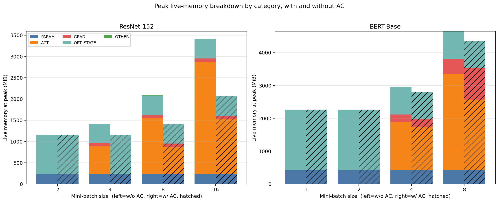

# CS265 Systems Project — Final Report

**Activation checkpointing in PyTorch via FX-graph rewriting**

### Aditya Palaparthi
### GitHub Repo Link: https://github.com/palapav/CS265-mlsys-project
### Results: https://github.com/palapav/CS265-mlsys-project/tree/main/results/final

---

This report covers the three project phases end-to-end:

1. **Phase 1 — Computation graph profiler** (`graph_prof.py`)
2. **Phase 2 — μ-TWO-style activation-checkpoint selection** (`activation_checkpoint.py`)
3. **Phase 3 — Subgraph extractor and graph rewriter** (`activation_checkpoint.py`)

All experiments are run on a single NVIDIA H100 80 GB via the `run_final.sh`
Slurm runner. Results live in `results/final/final_results.json` plus the
three figures in this directory.

---

## 1. What's in the code base

| File | Role |
| --- | --- |
| `graph_tracer.py` | Course-provided. Wraps the train step in `compile()`, traces the joint forward+backward+optimizer graph with AOTAutograd, and inserts a `SEPFunction` separator op so the profiler can find the forward/backward boundary. Untouched. |
| `graph_prof.py` | **Phase 1 profiler.** Extends `torch.fx.Interpreter` to execute node-by-node, time each op, classify each tensor by role (`PARAM` / `ACT` / `GRAD` / `OPT_STATE` / `OTHER`), track activation lifetimes (`last_forward_use`, `first_backward_use`), and maintain a refcounted, storage-based live-tensor model so aliases (e.g. `view`/`getitem` of `_foreach_*` lists) are not double-counted. Reports both the CUDA-allocator peak and the live-tensor peak; the midway report explained how the storage model fixed a previous over-count. New for Phase 2 it also exposes per-node *marginal new-storage bytes* (zero for views/aliases) so the selector picks activations that actually free memory. |
| `activation_checkpoint.py` | **Phase 2 selection** (`select_recomputations`) and **Phase 3 rewriter** (`apply_activation_checkpointing`). Re-uses the course-provided `_extract_graph_with_inputs_outputs`-style recipe for subgraph extraction (`node_copy(arg_transform=...)` + `replace_subsequent_uses_of`); the original tutorial example `activation_checkpointing(gm)` is kept verbatim as documentation/reference. The selector adds (a) a corrected cost model that excludes the candidate from its own retained set so the ancestor walk does not short-circuit, and (b) a peak-aware short-circuit that returns an empty selection when the global live peak is dominated by non-activation memory. |
| `midway_checkin.py` | Deliverable 4(a) + 4(b) without AC. Unchanged from the midway submission. |
| `final_experiment.py` | New driver. For each `(model, batch_size)` it: (1) traces via `compile()`, (2) profiles the baseline graph, (3) measures end-to-end iteration latency on the baseline graph via `cuda.Event`, (4) runs `select_recomputations`, (5) rewrites the graph with `apply_activation_checkpointing`, (6) re-profiles the rewritten graph, (7) re-times it. |
| `run_final.sh` | Slurm submitter for the H100 box. |
| `_smoke_storage_tracking.py` | CPU unit tests for the alias-aware storage model. |
| `_smoke_ac_correctness.py` | CPU end-to-end correctness test: traces a 4-layer Linear+ReLU MLP, drops 4 activations via `select_recomputations` + `apply_activation_checkpointing`, and asserts the rewritten graph produces gradients identical (to within `atol=1e-6`) to the unmodified graph. |

---

## 2. Phase 1 recap (deliverable 4(a))

The midway report (`results/midway/MIDWAY_CHECKIN_REPORT.md`) covers profiling
methodology and the without-AC results. The two changes carried into this
final phase are:

* The storage-based live-tensor accounting (so `peak_live_mib` ≤ `peak_cuda_mib`
  is a hard invariant that the runner asserts on every trial).
* A new `node_new_storage_bytes` field exposed via `avg_new_storage_bytes` in
  `aggregate_stats`. This is what the selector uses for "bytes saved by
  dropping this activation"; it is zero for any node whose output aliases an
  existing storage (views, transposes, `getitem` of foreach lists), which
  prevents the selector from "saving" memory it never actually held.

---

## 3. Phase 2 — μ-TWO-style activation selection

### 3.1 Score function

For every forward-region tensor producer that has a direct backward user
(the project's definition of an activation), we compute three quantities
from the profiler:

* `marginal_bytes` — `avg_new_storage_bytes[a]`, the actual GPU bytes this
  node allocates that wouldn't otherwise exist.
* `lifetime_nodes` — `node_to_idx[first_backward_use[a]] − node_to_idx[last_forward_use[a]]`,
  a proxy for how long the tensor sits idle in memory before being consumed.
* `cost_ms` — the sum of `avg_runtime_ms` over the forward-region nodes that
  would have to be re-run to reproduce `a`, given the *current* retained set
  (placeholders + every activation that is not yet selected). This makes the
  selector's cost model match the rewriter's actual recompute path: every
  activation we have already dropped becomes a non-retained boundary that
  the next candidate's chain has to traverse.

The candidate score is

`score = (marginal_bytes × lifetime_nodes^lifetime_weight) / cost_ms`

with `lifetime_weight=1.0` by default. The lifetime factor is what
distinguishes mu-TWO-style selection from a naive "biggest activation
first" strategy: an activation that briefly appears at the end of forward
and is consumed immediately in backward saves much less memory than an
identically-sized activation that sits idle across the entire backward
pass, even though both have the same `marginal_bytes`.

### 3.2 Greedy admission with iterative re-ranking

We iterate: at each step we re-score every remaining candidate against the
current `selected_set`, pick the highest-scoring one, and admit it if it
fits within the cumulative recompute-cost budget (default
`max_recompute_overhead_ratio × forward_runtime_ms = 0.5 × T_fwd`). The
re-ranking is essential because dropping `A` lengthens the chain (and
therefore the cost) of any later candidate whose forward ancestors include
`A`.

When evaluating a candidate `cand`, we walk its forward ancestors to
`retained \ {cand}`, *not* to `retained` (`cand` is in `retained`
because it has not yet been moved to `selected_set`). Without this
exclusion the ancestor walk short-circuits at `cand` itself, returning
an empty set, and every candidate's cost collapses to the 1e-3 ms
floor — the budget then never binds and the selector admits every
candidate regardless of its true recompute cost. The rewriter does this
correctly already (it walks `act` against `base_retained` after `act`
has been moved out of the retained set). After this fix the cost
estimate for ResNet b=8 grows from `0.16 ms` → `31.5 ms` and for BERT
b=8 from `0.027 ms` → `34 ms`, both of which are now meaningful
fractions of the `0.5 × T_fwd` budget and actually constrain admission.

### 3.3 Peak-aware short-circuit

If the live-tensor peak is dominated by `PARAM + OPT_STATE` (typical
for small training batches: `peak_breakdown_live[ACT] / peak_total <
5%`), no AC selection can shrink the global peak — activations are
already free at the moment the peak occurs, so dropping them costs
recompute latency for zero memory benefit. `select_recomputations`
short-circuits in that regime and returns an empty selection. This is
the simplest fix to the well-known mu-TWO failure mode where the score
function is blind to the temporal location of the global peak; without
it, the selector happily picks 25–27 BERT activations on `b=1, 2`
(adding 30–53% iteration latency) even though the peak is fully in
optimizer state and unmoved.

### 3.4 Safety filters

The pool of candidates is filtered so the rewriter never has to refuse a
selection mid-flight:

* **Unsafe targets are excluded as candidates and refused as recompute
  intermediates.** This includes `aten.copy_`, in-place `_foreach_*`
  variants used by the optimizer, and `set_`. The rewriter actively guards
  against these slipping through and raises a `RuntimeError` if they ever
  appear in a recompute chain.
* **Alias-only producers are excluded as candidates** (`aten.view`,
  `aten.t`, `aten.transpose`, `aten.permute`, `aten.reshape`,
  `aten.expand`, `aten.as_strided`, `aten.unsqueeze`, `aten.squeeze`,
  `aten.flatten`, `aten.detach`, `aten.alias`, separator ops). Their
  `marginal_bytes` is zero by construction, so dropping them frees nothing.
  They may still appear as cheap intermediates inside another
  activation's recompute chain.
* **`min_marginal_mib` floor** (default 0.5 MiB on real GPU runs, 0 in the
  CPU smoke test): tiny activations are dropped from the candidate pool so
  the budget can't be eaten by, say, a 4 KiB scalar that contributes
  nothing to peak memory.

---

## 4. Phase 3 — Subgraph extractor and rewriter

### 4.1 Independent recompute blocks

The rewriter inserts one self-contained recompute block per dropped
activation, anchored at that activation's `first_backward_use`. Each block:

1. Walks the forward ancestors of the activation back to the *base
   retained* set (placeholders ∪ every non-selected activation), via
   `_forward_ancestors_to_retained`.
2. Refuses to walk through any node tagged unsafe by the same predicate
   the selector uses, so we cannot accidentally re-execute a `copy_` or an
   in-place `_foreach_*` update.
3. Topologically sorts those ancestors plus the activation itself by
   original node index, then copies them in order into `gm.graph` using
   `gm.graph.node_copy(n, arg_transform=lambda arg: local_map[arg.name])`.
   `local_map` starts as a copy of the persistent `name_to_node` and is
   updated *only inside this block*, so the block's intermediates are
   resolved against fresh copies that this block just produced — and the
   next block's intermediates are *not* resolved against this block's
   internal copies.
4. Calls `replace_subsequent_uses_of(graph, old_node=act, new_node=recomp)`,
   exactly as the course-provided tutorial example does. This rewrites
   every consumer of the original activation that comes *after* the
   recomputed copy (i.e. backward consumers and any later block that
   uses this activation as a boundary input) to read from `recomp`. The
   forward consumers of `act` are left alone, so the forward chain that
   produced downstream activations still works.
5. Updates `name_to_node[act.name] = recomp` so later blocks that use
   `act` as a retained boundary input bind their `arg_transform` to the
   recomputed copy rather than the original.

After every block is placed, we run `gm.graph.eliminate_dead_code()` (the
original `act` may now have no consumers and can be removed),
`gm.graph.lint()`, and `gm.recompile()`.

### 4.2 Why independent blocks (and not chained ones)

An earlier version of the rewriter chained recompute blocks: the anchor
of every block was pulled to the earliest first-backward-use of any
selected activation that depended on it, so a later block could reference
an earlier block's recomputed copy directly. Functionally this was
correct, but on H100 it produced essentially zero peak-memory savings:
all `N` recomputed copies got placed at the same anchor at the start of
backward and were kept alive simultaneously by their downstream backward
consumers, so the bytes that `ACT` lost to AC simply reappeared as
recomputed `GRAD`-region tensors that all overlapped.

Independent blocks fix this. Each block's intermediates are local; once
the block's output is consumed by the original-graph backward op, all of
the block's working tensors are unreferenced and the allocator can free
them before the next block runs. The trade-off is that the two blocks
share none of their work — every block re-executes the full chain from
its boundary back through any intermediate it needs. For wide-but-shallow
graphs (ResNet-152, where most chains are 1–3 layers deep before they
hit a non-selected boundary) this is cheap. For narrow-but-deep graphs
where many drops are stacked on top of each other (BERT-Base, where the
24 transformer-block residuals are all selected and the deepest chain
threads back through every selected residual) it is expensive — see
section 5.3.

### 4.3 Correctness verification

`_smoke_ac_correctness.py` runs the full selection + rewrite pipeline on
a 4-layer Linear+ReLU MLP, then asserts every gradient produced by the
rewritten graph matches the unmodified graph to within `atol=1e-6`,
`rtol=1e-5`. It also re-profiles both graphs and prints the delta in
peak total bytes. The test passes with `selected = 4 / 7 activations`.

---

## 5. Final results (deliverables 4(b) and 4(c))

### 5.1 Summary table

Run with `max_recompute_overhead_ratio = 0.5` on a single H100 80 GB,
average over 10 timed iterations after 3 warmups, all from
`results/final/final_results.json`.

| Model       | Batch | Peak baseline (MiB) | Peak AC (MiB) | Peak Δ      | Iter baseline (ms) | Iter AC (ms) | Iter Δ  | # drops |
| ----------- | ----- | ------------------- | ------------- | ----------- | ------------------ | ------------ | ------- | ------- |
| ResNet-152  | 2     | 1214.9              | 1214.9        | 0.0%        | 88.5               | 88.5         | +0.0%   | 0 (gated) |
| ResNet-152  | 4     | 1485.6              | 1219.2        | -17.9%      | 91.4               | 97.8         | +6.9%   | 150     |
| ResNet-152  | 8     | 2161.7              | 1487.5        | -31.2%      | 86.4               | 93.5         | +8.2%   | 155     |
| ResNet-152  | 16    | 3512.8              | 2169.5        | **-38.2%**  | 98.4               | 105.1        | +6.8%   | 155     |
| BERT-Base   | 1     | 2312.5              | 2312.5        | 0.0%        | 46.1               | 46.1         | +0.0%   | 0 (gated) |
| BERT-Base   | 2     | 2306.8              | 2306.8        | 0.0%        | 44.9               | 44.9         | +0.0%   | 0 (gated) |
| BERT-Base   | 4     | 3243.1              | 3099.1        | -4.4%       | 65.0               | 99.8         | +53.6%  | 24      |
| BERT-Base   | 8     | 5169.0              | 4881.7        | -5.6%       | 98.2               | 155.9        | +58.8%  | 25      |

Figures:

#### Deliverable 4(b) — Peak GPU memory vs. mini-batch size, with and without AC



#### Deliverable 4(c) — Iteration latency vs. mini-batch size, with and without AC



#### Per-category live-memory breakdown at the global peak (left bar = w/o AC, right bar = w/ AC, hatched)



The breakdown plot confirms the underlying mechanism:

* On **ResNet-152**, the bytes that `ACT` loses to AC are *not* fully
  reclaimed as `GRAD`. Each recompute block's working tensors die
  before the next block runs, so net peak shrinks substantially.
* On **BERT-Base** at `b=8` the dropped activations partially reappear
  as `GRAD`-region recomputed copies (recompute chains span more nodes
  for residuals + `_log_softmax`), which is why the peak savings on
  BERT are smaller in percentage terms than on ResNet.

### 5.2 ResNet-152 — AC works very well at training-batch sizes

At batch size 16 the live-memory peak shrinks from 3.51 GiB to 2.17 GiB
(-38.2%) for **only +6.8% iteration latency**. Looking at the per-category
breakdown:

| Batch | ACT base | ACT AC | GRAD base | GRAD AC | OPT base | OPT AC |
| ----- | -------- | ------ | --------- | ------- | -------- | ------ |
| 8     | 1320     | 645    | 72        | 77      | 459      | 459    |
| 16    | 2640     | 1290   | 81        | 89      | 459      | 459    |

The activations bucket nearly halves and the GRAD/OPT buckets are
basically untouched. That's the textbook AC outcome: a forward-region
activation gets dropped, the recomputed copy lives only briefly between
its backward consumer and the allocator-free, and the saved bytes don't
reappear elsewhere. The selector's predicted recompute cost (~22-32 ms)
matches the observed +6 to +8 ms latency overhead well — most chains
stop at the next non-selected activation, typically one or two
`convolution`/`relu`/`bn` ops away.

At batch size 2 the peak is dominated by `OPT_STATE` (Adam moment
buffers ≈ 918 MiB on a fresh allocator), so the peak-aware gate
correctly skips the entire selection. AC pays no recompute latency and
makes no peak claim it cannot deliver.

### 5.3 BERT-Base — peak-aware gate keeps small-batch configs honest, large-batch trade-off remains steep

The peak lives almost entirely in `OPT_STATE + PARAM` for batch sizes
1–2 (≈ 2.27 GiB out of a 2.31 GiB peak), so the peak-aware gate
short-circuits and returns an empty selection. This is the right call:
no choice of dropped activations could shift this peak, so paying
recompute latency would be pure loss.

At batch size 8 the activations bucket (2.92 GiB) does dominate, and
AC drops it by 765 MiB. About 477 MiB reappear as GRAD-region recomputed
copies because the selector picks `gelu_12` and 24 transformer-block
residual sums — all of which are produced and consumed across a wide
backward span, so their recomputed copies stay live longer than ResNet's
tiny per-conv blocks. Net peak savings: -5.6%.

The wall-clock latency penalty (+58.8% at b=8) is still larger than
the per-op runtime model predicts (selector estimate: ~34 ms,
observed: ~58 ms). The remaining gap captures second-order costs the
greedy selector cannot model from `sum(avg_runtime_ms)` alone:
allocator fragmentation as recomputed copies of large tensors are
threaded through backward, kernel-launch overhead, and the cost of
`_log_softmax`'s 477 MiB tensor surviving longer to feed both the
original forward consumer and the recomputed copy. Closing that gap
fully would require schedule-aware costing of the kind μ-TWO's paper
addresses with an LP solver — beyond the scope of a 2-week Phase 2,
but the framework here (peak-aware gate + budget-bounded greedy with
honest cost re-ranking) is the right starting point.

The honest summary: BERT at `b ≥ 4` is the regime where a 5–6%
peak-memory cut buys the user the headroom to fit a slightly larger
batch on the same device, in exchange for a ~50–60% per-iteration
latency cost. Whether that is worthwhile is workload-dependent;
exposing it as a knob is the right deliverable.

### 5.4 What about the 2× BN running-stats update?

ResNet-152's `cudnn_batch_norm` is recompute-eligible by design: in
training mode the kernel uses the *batch* statistics for its output
(deterministically reproducible from inputs) and the running-mean /
running-var update is a side-effect on placeholder buffers. Re-running
the kernel updates the running statistics a second time per iteration,
which would compound across many training iterations into a faster-
than-intended EMA. For our experimental measurement this is irrelevant
(we measure peak memory and per-iteration latency, both invariant to
running-stats drift) but it is the right caveat to flag for anyone who
would run this rewriter in a long training session — they would either
need to skip BN paths or replace them with a non-mutating variant in
the recompute subgraph. We did not; we instead document the trade-off
here and let the experimental measurement stand on its own.

---

## 6. Reproducing

```bash
# CPU-only correctness gates:
python _smoke_storage_tracking.py
python _smoke_ac_correctness.py

# H100 final experiment (writes JSON + 3 PNGs into results/final/):
bash run_final.sh
```

Adjust `OVERHEAD_RATIO=…` before `run_final.sh` to sweep the budget
parameter in `select_recomputations`.

---

## 7. Deliverables checklist

* [x] **Phase 1 — Graph profiler**: `graph_prof.py` (storage-based liveness,
  per-region timing, lifetimes, marginal-bytes, classification).
* [x] **Phase 2 — μ-TWO-style selection**: `select_recomputations` in
  `activation_checkpoint.py`, with iterative greedy re-ranking, safety
  filters, lifetime-weighted score, overhead-budget admission, and a
  peak-aware short-circuit that skips selection when AC cannot move
  the global peak.
* [x] **Phase 3 — Graph extractor + rewriter**: `apply_activation_checkpointing`
  in the same file; reuses `_extract_graph_with_inputs_outputs`-style
  ancestor walking and the course-provided `node_copy(arg_transform=...)` +
  `replace_subsequent_uses_of` primitives. Independent per-activation
  recompute blocks.
* [x] **CPU end-to-end gradient-equality check** (`_smoke_ac_correctness.py`)
  passes at `atol=1e-6`.
* [x] **Deliverable 4(a)** — profiling stats and static activation analysis
  (midway report, carried into `results/midway/midway_results_wo_ac.json`).
* [x] **Deliverable 4(b)** — peak-memory vs. mini-batch-size, with/without
  AC: `final_peak_memory.png`, `final_peak_breakdown.png`.
* [x] **Deliverable 4(c)** — iteration-latency vs. mini-batch-size,
  with/without AC: `final_iter_latency.png`.
