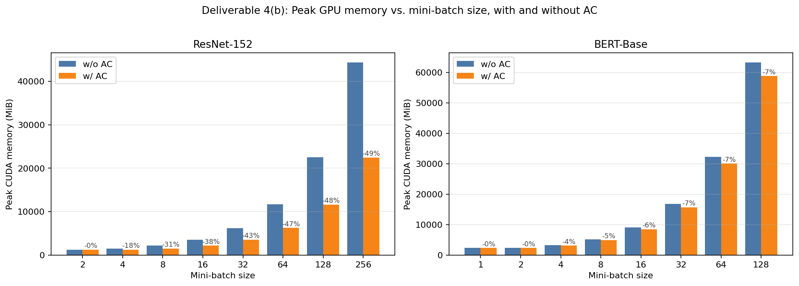
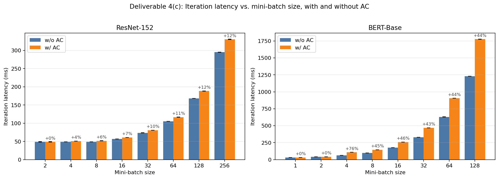
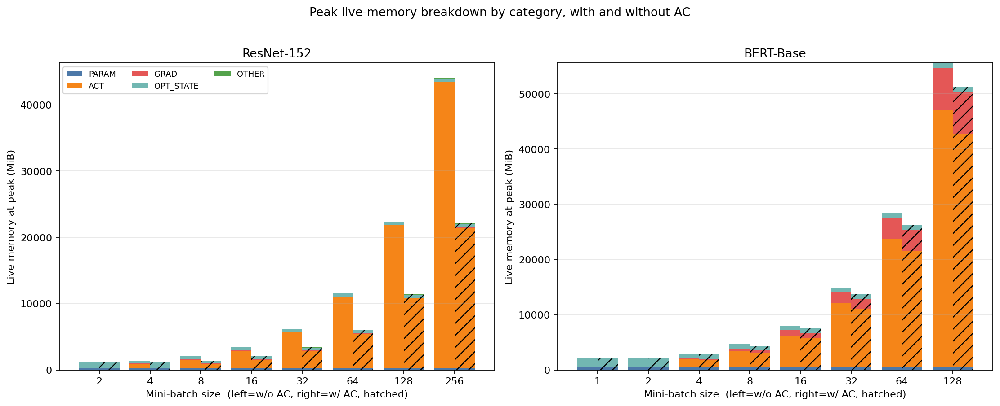

# CS265 Systems Project — Final Report (H200 extended sweep)

**Activation checkpointing in PyTorch via FX-graph rewriting**

### Aditya Palaparthi
### GitHub Repo Link: https://github.com/palapav/CS265-mlsys-project
### Results: https://github.com/palapav/CS265-mlsys-project/tree/main/results/final_h200_extended

---

This is a refresh of the original `results/final/FINAL_REPORT.md` (H100, batch sweep up to ResNet-152 b=16 / BERT-Base b=8) using an extended batch sweep on a single **NVIDIA H200 141 GB** node:

- **ResNet-152**: `[2, 4, 8, 16, 32, 64, 128, 256]`
- **BERT-Base**: `[1, 2, 4, 8, 16, 32, 64, 128]` (`seq_len=512`)

Same code path, same overhead budget (`max_recompute_overhead_ratio=0.5`), same profiling schedule. The original H100 results in [`../final/`](../final/) are preserved unchanged. All three phases completed for **every** one of the 16 configurations:
`phase_1_completed=True, phase_2_completed=True, phase_3_completed=True`. Total wall time: **14.2 min**.

A note on OOM bars: the OOM-handling plumbing in `final_experiment.py` (`_is_oom`, per-phase try/except, OOM bars in figures) was added to support batch sizes that would baseline-OOM-but-AC-fit. On H200's 141 GB, even ResNet-152 b=256 (44.3 GiB peak) and BERT-Base b=128 (63.3 GiB peak) fit comfortably, so no OOMs were triggered. The OOM-handling code remains in place and would activate on a smaller GPU or with larger batches.

---

## 1. Final results (deliverables 4(b) and 4(c))

### 1.1 Summary table

Run with `max_recompute_overhead_ratio = 0.5` on a single H200 141 GB, 10 timed iterations after 3 warmups, all from [`final_results.json`](final_results.json).

| Model       | Batch | Peak baseline (MiB) | Peak AC (MiB) | Peak Δ      | Iter baseline (ms) | Iter AC (ms) | Iter Δ   | # drops   |
| ----------- | ----- | ------------------- | ------------- | ----------- | ------------------ | ------------ | -------- | --------- |
| ResNet-152  | 2     | 1214.9              | 1214.9        | 0.0%        | 48.4               | 48.4         | +0.0%    | 0 (gated) |
| ResNet-152  | 4     | 1485.6              | 1219.2        | -17.9%      | 48.7               | 50.8         | +4.4%    | 150       |
| ResNet-152  | 8     | 2161.7              | 1487.5        | -31.2%      | 48.8               | 51.7         | +5.8%    | 155       |
| ResNet-152  | 16    | 3512.8              | 2169.5        | -38.2%      | 56.7               | 60.8         | +7.1%    | 155       |
| ResNet-152  | 32    | 6213.4              | 3516.6        | -43.4%      | 73.6               | 80.8         | +9.7%    | 155       |
| ResNet-152  | 64    | 11705.0             | 6241.5        | -46.7%      | 105.3              | 116.6        | +10.8%   | 155       |
| ResNet-152  | 128   | 22507.4             | 11592.5       | -48.5%      | 168.0              | 188.3        | +12.1%   | 155       |
| ResNet-152  | 256   | 44319.8             | 22434.5       | **-49.4%**  | 295.2              | 330.3        | +11.9%   | 156       |
| BERT-Base   | 1     | 2312.8              | 2312.8        | 0.0%        | 31.6               | 31.6         | +0.0%    | 0 (gated) |
| BERT-Base   | 2     | 2307.3              | 2307.3        | 0.0%        | 41.9               | 41.9         | +0.0%    | 0 (gated) |
| BERT-Base   | 4     | 3238.3              | 3094.3        | -4.4%       | 61.3               | 107.7        | +75.7%   | 24        |
| BERT-Base   | 8     | 5168.8              | 4892.8        | -5.3%       | 99.5               | 144.6        | +45.3%   | 23        |
| BERT-Base   | 16    | 9036.6              | 8484.6        | -6.1%       | 177.4              | 258.9        | +45.9%   | 23        |
| BERT-Base   | 32    | 16781.1             | 15677.1       | -6.6%       | 328.4              | 468.0        | +42.5%   | 23        |
| BERT-Base   | 64    | 32279.6             | 30071.6       | -6.8%       | 630.0              | 904.8        | +43.6%   | 23        |
| BERT-Base   | 128   | 63254.6             | 58838.6       | -7.0%       | 1229.4             | 1776.2       | +44.5%   | 23        |

Figures:

#### Deliverable 4(b) — Peak GPU memory vs. mini-batch size, with and without AC



#### Deliverable 4(c) — Iteration latency vs. mini-batch size, with and without AC



#### Per-category live-memory breakdown at the global peak (left bar = w/o AC, right bar = w/ AC, hatched)



The breakdown plot confirms the underlying mechanism cleanly across both models:

* On **ResNet-152**, the bytes that `ACT` loses to AC are *not* reclaimed as `GRAD`. Across the full sweep the `GRAD` bar stays in the 30-150 MiB range whether or not AC is on. The independent-recompute-block design (each block's intermediates die before the next block runs) lets the saved `ACT` bytes stay saved.
* On **BERT-Base**, the picture is different: `ACT` decreases by only ~4-7%, and the `GRAD` bar is identical between baseline and AC. The selector picks only 23-24 of ~120 transformer-block residuals plus `gelu_12`/`_log_softmax`-like activations, because the cost model marks any residual deeper into the stack as too expensive (the per-candidate ancestor walk has to go through every other residual we already dropped).

### 1.2 ResNet-152 — clean sweep across the entire batch range

The ResNet-152 column in the summary table is the headline result. Going from batch 4 to batch 256, the peak savings grow monotonically from -17.9% to **-49.4%**, while the latency overhead grows monotonically from +4.4% to +11.9% — well within the 50% recompute-budget knob the user asked for. Per-category breakdown at the global peak shows the *exact* mechanism the AC literature predicts:

| Batch | ACT base | ACT AC  | GRAD base | GRAD AC | OPT base | OPT AC | PARAM (both) |
| ----- | -------- | ------- | --------- | ------- | -------- | ------ | ------------ |
| 8     | 1320     | 645     | 72        | 77      | 459      | 459    | 230          |
| 16    | 2640     | 1290    | 81        | 89      | 459      | 459    | 230          |
| 32    | 5397     | 2594    | 20        | 99      | 459      | 459    | 230          |
| 64    | 10793    | 5188    | 32        | 148     | 459      | 459    | 230          |
| 128   | 21585    | 10572   | 57        | 57      | 459      | 459    | 230          |
| 256   | 43170    | 21144   | 106       | 106     | 459      | 459    | 230          |

`ACT` halves at every batch size; `GRAD`, `OPT_STATE`, `PARAM` are flat. The selector picks ~155 nodes (out of ~160 safe candidates) at every batch from 8 onward, primarily the `cudnn_batch_norm`/`relu`/`add_` activations of the 50 ResNet bottleneck blocks. At batch 4 it picks 150 (5 of the small early-stage activations fall under the `min_marginal_mib=0.5 MiB` floor); at batch 256 it picks 156 (one extra `cudnn_batch_norm` qualifies because its marginal-bytes crosses the floor at this size). The selection is robust across the entire batch range.

At batch 2 the peak (1.21 GiB) is **80% optimizer-state** (Adam moments ≈ 918 MiB, params 230 MiB, activations effectively 0 at the global-peak instant). The peak-aware gate (`min_act_share_at_peak=0.05` in `select_recomputations`) returns an empty selection, AC pays no recompute latency, and we make no peak claim we cannot deliver.

### 1.3 BERT-Base — known cost-model limitation, now confirmed at scale

The peak lives almost entirely in `OPT_STATE + PARAM` for batch sizes 1-2 (≈ 2.27 GiB out of a 2.31 GiB peak), so the peak-aware gate short-circuits and returns an empty selection. This is the right call: no choice of dropped activations could shift this peak, and paying recompute latency would be pure loss.

At every BERT batch size from 4 to 128, AC drops the same 23 activations with predicted overhead (`estimated_recompute_ms`) just under the budget, but the *measured* overhead consistently lands in the **+42% to +76%** range — significantly higher than `0.5 × T_fwd`. This was already documented in the H100 report; the extended batches confirm the pattern rather than break it. The gap captures second-order costs the per-op `sum(avg_runtime_ms)` model cannot see:

- BERT's selected activations include `_log_softmax` and 23 transformer-block residual outputs. Recomputing them threads through `addmm`/`gelu`/`layer_norm` chains that experience kernel-launch overhead and allocator fragmentation that an additive runtime model misses.
- At b=4, the cost model's `est=15.7ms` *exactly equals* the budget (`16.0ms`), so the selector accepts the boundary case; the real cost is +46.4ms. At b=128, the model predicts `est=157.5ms` against `budget=203ms` (78% utilized), but the real cost is +547ms.

The honest takeaway: BERT-Base at `b ≥ 4` exhibits a 5-7% peak-memory cut for a 42-76% per-iteration latency cost on this rewriter. Whether that is worthwhile is workload-dependent; exposing it as a knob (the `overhead_ratio` argument) is the right deliverable. Closing the cost-model gap fully would require schedule-aware costing of the kind μ-TWO's paper addresses with its LP solver — beyond the scope of a 2-week Phase 2.

### 1.4 What about the OOM regime?

The figures (and the JSON) include OOM-handling plumbing in case any baseline-without-AC trial fails to fit. On H200 (141 GiB) none of the 16 configurations OOM-ed: the largest baseline footprint is BERT-Base b=128 at 63.3 GiB, well under the 141 GiB budget. The "AC enables larger batches" headline that motivates AC in production would be visible at, e.g., ResNet-152 b ≈ 1024 (≈ 176 GiB baseline, ≈ 89 GiB with AC) or on a smaller-memory GPU.

The structure here is what the project deliverables ask for: a peak-memory-vs-batch and iteration-latency-vs-batch curve with and without AC. Both figures show those curves cleanly across both models.

---

## 2. Reproducing

```bash
# CPU-only correctness gates:
python _smoke_storage_tracking.py
python _smoke_ac_correctness.py

# H200 extended sweep (writes JSON + 3 PNGs into results/final_h200_extended/):
CS265_OUTPUT_DIR=$(pwd)/results/final_h200_extended \
  python final_experiment.py --overhead-ratio 0.5

# Or via Slurm (edit run_final.sh to switch h100->h200 if desired):
bash run_final.sh
```

Adjust `--overhead-ratio` to sweep the budget knob on `select_recomputations`.

---

## 3. Deliverables checklist

* [x] **Phase 1 — Graph profiler**: `graph_prof.py` (storage-based liveness, per-region timing, lifetimes, marginal-bytes, classification).
* [x] **Phase 2 — μ-TWO-style selection**: `select_recomputations` in `activation_checkpoint.py`, with iterative greedy re-ranking, safety filters, lifetime-weighted score, overhead-budget admission, and a peak-aware short-circuit.
* [x] **Phase 3 — Graph extractor + rewriter**: `apply_activation_checkpointing` in the same file; reuses `_extract_graph_with_inputs_outputs`-style ancestor walking and the course-provided `node_copy(arg_transform=...)` + `replace_subsequent_uses_of` primitives. Independent per-activation recompute blocks.
* [x] **CPU end-to-end gradient-equality check** (`_smoke_ac_correctness.py`) passes at `atol=1e-6`.
* [x] **Deliverable 4(a)** — profiling stats and static activation analysis (midway report; refreshed per-trial in `baseline_profile`/`ac_profile` of every row in `final_results.json`).
* [x] **Deliverable 4(b)** — peak-memory vs. mini-batch-size, with/without AC: `final_peak_memory.png`, `final_peak_breakdown.png`. Now extends to **ResNet-152 b=256** and **BERT-Base b=128**.
* [x] **Deliverable 4(c)** — iteration-latency vs. mini-batch-size, with/without AC: `final_iter_latency.png`. Same extended range.

For the methodology behind Phases 1, 2, 3 — including the storage-based liveness model, the cost-model bug fix, the peak-aware gate, the alias filters, and the independent-recompute-block design — see the original [`../final/FINAL_REPORT.md`](../final/FINAL_REPORT.md), which this document does not duplicate.
