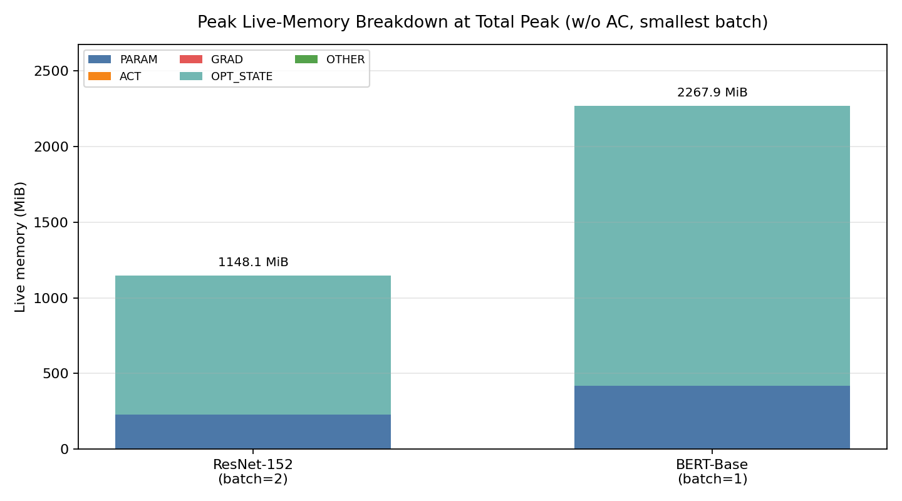
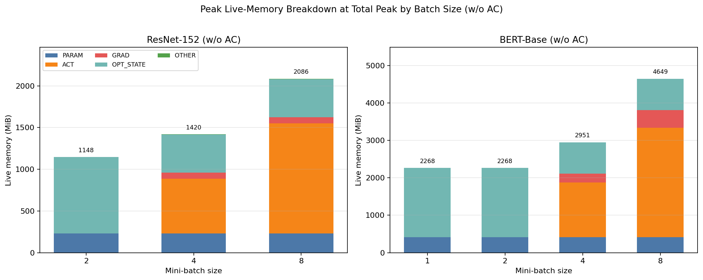
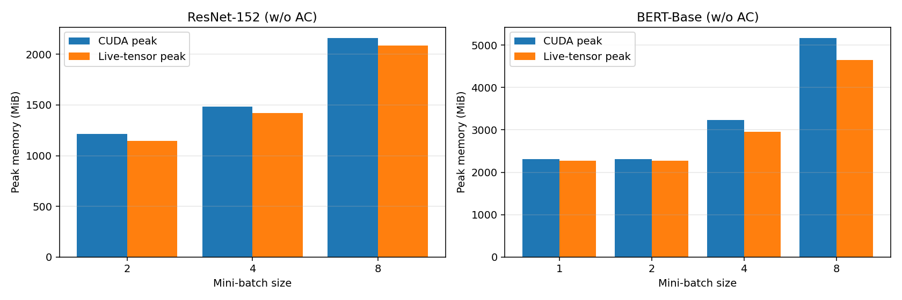

# Midway Check-in Report  
CS265 Systems Project: Activation Checkpointing (w/o AC Baseline)

### Aditya Palaparthi
### GitHub Repo Link: https://github.com/palapav/CS265-mlsys-project
### Results: https://github.com/palapav/CS265-mlsys-project/tree/main/results/midway
---

## 1. Introduction

This midway check-in completes **Phase 1 (Graph Profiler)** and reports the required **w/o AC** baseline experiments from the systems project deliverables **4(a)** and **4(b)**. The implementation in `graph_prof.py` profiles a full training iteration graph (forward + backward + optimizer), computes per-node runtime/memory statistics, performs static activation lifetime analysis (last forward use and first backward use), and produces peak-memory summaries. Experiments are automated in `midway_checkin.py` for `ResNet-152` and `BERT-Base`, with raw outputs in `midway_results_wo_ac.json`, the peak-memory-vs-batch graph in `midway_peak_memory_wo_ac.png`, the smallest-batch category breakdown in `midway_peak_breakdown_at_peak_wo_ac.png`, and a per-batch breakdown across all configs in `midway_peak_breakdown_per_batch_wo_ac.png`.

Phase 1 builds the profiler needed to drive later activation-checkpointing decisions.

---

## 2. Problems Tackled

- `[Full-Iteration Graph Profiling]` Build a profiler that runs a traced graph node-by-node and captures compute/memory metrics over forward, backward, and optimizer phases.
- `[Forward/Backward Boundary Detection]` Reliably separate forward and backward regions in the traced graph to support static activation analysis.
- `[Activation Lifetime Analysis]` Identify activation tensors and compute each activation's last forward use and first backward use.
- `[Storage-Accurate Memory Modeling]` Track live tensor memory by **underlying CUDA storage**, not by per-node output bytes, so aliasing ops (`view`, `t`, `transpose`, `_foreach_*` + `getitem`, in-place `copy_`, etc.) never double-count memory and the breakdown is bounded above by `torch.cuda.max_memory_allocated()`.
- `[Memory Breakdown at Peak]` Track a live-storage memory model and break peak memory into semantic categories (`PARAM`, `ACT`, `GRAD`, `OPT_STATE`, `OTHER`).
- `[Midway Deliverables Automation]` Run repeatable baseline experiments across mini-batch sizes, validate invariants per run, export machine-readable results, and generate the required peak-memory bar graph (w/o AC).

---

## 3. Technical Description

### Problem/Solution 1: Full-iteration graph profiling

- **a) Problem framing:**  
  Midway deliverable 4(a) requires operator-level profiling statistics for training, not just forward inference. The challenge is that a standard model call does not expose a single explicit graph containing forward, backward, and optimizer updates in a form that can be profiled node-by-node.

- **b) High-level solution:**  
  Use the project compiler/tracer (`graph_tracer.compile`) to trace a full `train_step` and apply a custom transformation that instantiates `GraphProfiler` (subclassing `torch.fx.Interpreter`). The profiler executes nodes in topological order and records runtime and memory statistics for each node.

- **c) Deeper details:**  
  `GraphProfiler.run_node()` uses CUDA events for timing (`start_event`/`end_event`) and records memory deltas via `torch.cuda.memory_allocated()`. `GraphProfiler.run()` also tracks `torch.cuda.max_memory_allocated()` per profiled iteration and aggregates across profile runs. Warmup/profile scheduling is handled in `midway_checkin.py` via `warmup_iters=1`, `profile_iters=2`.

### Problem/Solution 2: Forward/backward separation and activation lifetime analysis

- **a) Problem framing:**  
  Activation checkpointing depends on knowing when each activation is last needed in forward and first needed in backward. Without explicit phase boundaries, static lifetime analysis is unreliable.

- **b) High-level solution:**  
  Insert separator ops in the train step (`SEPFunction.apply`) and locate them in the FX graph (`separator.sep.default` and `separator.sep_backward.default`) to define forward and backward boundaries.

- **c) Deeper details:**  
  In `GraphProfiler._analyze_activations()`, a node is treated as a strict activation candidate (the AC-relevant set, used by Phase 2) if it is produced in forward and has at least one direct backward user. The profiler stores:
  - `last_forward_use[node]`: latest forward user by node index.
  - `first_backward_use[node]`: earliest backward user by node index.  
  These statistics are exported in `largest_activations` for direct inspection.

### Problem/Solution 3: Storage-accurate memory modeling and category breakdown

- **a) Problem framing:**  
  Deliverable 4(a) asks for memory profiling and analysis, not just a single scalar peak. We need an interpretable category-level breakdown at peak. Naive accounting that adds the bytes of every node's output produces values that exceed `torch.cuda.max_memory_allocated()` (which is physically impossible) because aliasing ops produce new fx.Nodes that share storage with their inputs.

- **b) High-level solution:**  
  Maintain a refcounted map of **unique CUDA storages** (keyed by `untyped_storage().data_ptr()`, sized by `untyped_storage().nbytes()`). On each node, increment the refcount for every storage in its output; on input release, decrement and free when the refcount hits zero. Categories are attributed at the **first producer**, so an aliasing op never re-categorizes an already-tracked storage.

- **c) Deeper details:**  
  - `peak_breakdown_live_mib`: category composition **at the instant of total live-memory peak** (sums exactly to `peak_live_mib`).
  - `peak_category_max_live_mib`: per-category maxima over the whole iteration (their sum can exceed total because peaks happen at different times).  
  - For decomposed Adam graphs (foreach/copy form), placeholder roles are inferred from runtime tensor identity and categorized as `PARAM`, `OPT_STATE`, or `OTHER`. Optimizer-region intermediates (foreach math, `getitem` unpacks of `_foreach_*` lists, denom/sqrt buffers, addcdiv step temporaries) are categorized as `OPT_STATE` because they are optimizer working memory; routing them into `PARAM` would misattribute Adam transient buffers to model parameters.
  - Forward-region tensor-producing nodes are categorized as `ACT` for memory accounting. The strict, AC-relevant subset (forward-produced + has a direct backward user) is also retained on the profiler as `activation_nodes` for the Phase 2 algorithm; `node_type_counts['act']` is therefore the broader memory-accounting count, while `num_activations` is the strict AC-candidate count. Backward-compute-region nodes are categorized as `GRAD`.
  - Each profiled iteration validates `peak_breakdown_live_mib` sums to `peak_live_mib` and that `peak_live_mib <= peak_cuda_mib`, so accounting bugs surface immediately rather than reaching figures.

### Problem/Solution 4: Midway experiments and required artifacts (w/o AC)

- **a) Problem framing:**  
  Midway requires (i) profiling + static analysis statistics and (ii) peak memory vs mini-batch size bar graph, both **without activation checkpointing**.

- **b) High-level solution:**  
  Run `ResNet-152` and `BERT-Base` baselines across specified batch sizes in `midway_checkin.py`, collect profiler summaries into JSON, validate each summary against the storage-model invariants, and render the peak-memory bar graph and category breakdowns from those summaries.

- **c) Deeper details:**  
  - `ResNet-152` batch sizes: `2, 4, 8`
  - `BERT-Base` batch sizes: `1, 2, 4, 8` (`seq_len=512`)  
  Results are serialized in `midway_results_wo_ac.json`; figures are saved to `midway_peak_memory_wo_ac.png`, `midway_peak_breakdown_at_peak_wo_ac.png`, and `midway_peak_breakdown_per_batch_wo_ac.png`.

---

### Verified Midway Deliverables (w/o AC)

#### Check-in status

- Phase 1 completed (DONE).
- Deliverable 4(a): computation/memory profiling + static activation analysis. (DONE)
- Deliverable 4(b): peak memory vs mini-batch size graph (w/o AC). (DONE)
- Phase-1 peak memory breakdown graphs from collected stats included. (DONE)

#### Experimental setup used for verification

- Device: `NVIDIA H100 80GB HBM3`
- Seed: `torch.manual_seed(0)`
- Profiler schedule: `1` warmup + `2` profile iterations
- Models: `ResNet-152`, `BERT-Base`
- Verification run command (also wrapped in `run_midway.sh`):

```bash
srun --partition=pi_faez --gres=gpu:h100:1 --cpus-per-task=8 --mem=128G --time=02:00:00 \
  bash -c "source /orcd/compute/faez/001/miniforge3/etc/profile.d/conda.sh && conda activate cs265 && cd /home/apalapar/projects/CS265-mlsys-project && python midway_checkin.py"
```

#### Deliverable 4(a): profiling statistics and static analysis

Baseline summary configurations (smallest successful batch for each model):

| Model | Batch | Graph nodes | Strict activations | Peak CUDA MiB | Peak live MiB |
|---|---:|---:|---:|---:|---:|
| ResNet-152 | 2 | 18498 | 777 | 1213.80 | 1148.09 |
| BERT-Base | 1 | 8810 | 353 | 2314.14 | 2267.89 |

`peak_live_mib <= peak_cuda_mib` holds for every measured config (validated per run; see "Storage-accuracy validation" below). Strict activations is `len(activation_nodes)`: forward-produced nodes with a direct backward user; this is the candidate set for the Phase 2 AC algorithm.

Peak live-memory breakdown at total peak (MiB, sums exactly to `peak_live_mib`):

| Model | Batch | PARAM | ACT | GRAD | OPT_STATE | OTHER |
|---|---:|---:|---:|---:|---:|---:|
| ResNet-152 | 2 | 229.62 | 0.00 | 0.00 | 918.47 | 0.00 |
| BERT-Base | 1 | 417.76 | 0.00 | 0.00 | 1850.13 | 0.00 |

Note: at these baseline (smallest) batches, the model's total live-memory peak occurs in the **optimizer-update region**; activation memory has already been released by the end of backward, so its contribution at that exact timestamp is `0.00`. Activation maxima are still substantial — see the per-category-maxima table and the per-batch breakdown figure below — and dominate at larger batches. The OPT_STATE bar at smallest batches is approximately `4 * PARAM` because Adam's update step keeps `m`, `v`, and two foreach working buffers (`denom`, `sqrt(v_hat)` / addcdiv step) live simultaneously.

Peak memory breakdown graph (stacked bars at total-peak timestamp, smallest-batch configs):



Peak memory breakdown graph across all batch sizes (shows the regime change from optimizer-bound peak at small batches to activation-bound peak at larger batches):



Per-category maxima over full iteration (MiB, **do not** sum to total peak; samples each category at its own worst-case timestamp):

| Model | Batch | PARAM | ACT | GRAD | OPT_STATE | OTHER |
|---|---:|---:|---:|---:|---:|---:|
| ResNet-152 | 2 | 229.62 | 337.94 | 241.51 | 918.47 |   1.66 |
| ResNet-152 | 4 | 229.62 | 675.05 | 253.84 | 918.47 |   2.94 |
| ResNet-152 | 8 | 229.62 | 1349.66 | 278.32 | 918.47 |   5.20 |
| BERT-Base | 1 | 417.76 | 364.86 | 507.18 | 1850.13 |   0.04 |
| BERT-Base | 2 | 417.76 | 729.71 | 507.18 | 1850.13 |   0.04 |
| BERT-Base | 4 | 417.76 | 1459.50 | 507.18 | 1850.13 |   0.04 |
| BERT-Base | 8 | 417.76 | 2919.01 | 578.30 | 1850.13 |   0.13 |

Top runtime operators (avg ms):

- **ResNet-152 (batch 2):** `_foreach_div.List` (3.69), `_foreach_div.List` (3.07), `_foreach_addcdiv.Scalar` (2.26), `_foreach_addcmul.Scalar` (2.18), `_foreach_mul.Scalar` (1.75)
- **BERT-Base (batch 1):** `_foreach_div.List` (2.10), `_foreach_addcdiv.Scalar` (1.70), `_foreach_addcmul.Scalar` (1.57), `_foreach_div.List` (1.55), `_foreach_mul.Scalar` (1.09)

Largest activations with lifetime boundaries (size MiB, `last_fwd -> first_bwd`):

- **ResNet-152 (batch 2):**
  - `t` (7.81, `addmm -> t_1`)
  - `convolution` (6.12, `cudnn_batch_norm -> cudnn_batch_norm_backward_154`)
  - `convolution_3` (6.12, `cudnn_batch_norm_3 -> cudnn_batch_norm_backward_151`)
- **BERT-Base (batch 1):**
  - `t_73` (89.42, `addmm_73 -> t_74`)
  - `_log_softmax` (59.61, `nll_loss_forward -> nll_loss_backward`)
  - `t_29` (9.00, `addmm_29 -> t_250`)

Graph-level evidence (baseline configs):

- **Placeholder role categorization:**  
  - ResNet-152 batch 2: `param=467`, `opt_state=1401`, `other=469`, `total=2337`  
  - BERT-Base batch 1: `param=204`, `opt_state=612`, `other=6`, `total=822`
- **Boundary indices from traced graph:**  
  - ResNet-152 batch 2: `forward_end_idx=3634`, `backward_start_idx=3637`, `optimizer_start_idx=4937`
  - BERT-Base batch 1: `forward_end_idx=1505`, `backward_start_idx=1508`, `optimizer_start_idx=2876`
- **Region node counts:**  
  - ResNet-152 batch 2: `forward=3635`, `backward_compute=1300`, `optimizer=13561`
  - BERT-Base batch 1: `forward=1506`, `backward_compute=1368`, `optimizer=5934`
- **Separator validation checks:** all `true` for both models (`forward_separator_found`, `backward_separator_found`, `forward_before_backward`, `optimizer_after_backward`).

Representative node-trace evidence around boundaries:

```text
ResNet-152 (batch 2):
idx 3634: separator.sep.default
idx 3637: separator.sep_backward.default
idx 4937: aten._foreach_add.Scalar   (optimizer starts)

BERT-Base (batch 1):
idx 1505: separator.sep.default
idx 1508: separator.sep_backward.default
idx 2876: aten._foreach_add.Scalar   (optimizer starts)
```

Storage-accuracy validation (per-config invariant checks, all pass):

| Model | Batch | peak_live MiB | peak_cuda MiB | breakdown sum MiB | live ≤ cuda |
|---|---:|---:|---:|---:|:---:|
| ResNet-152 | 2 | 1148.09 | 1213.80 | 1148.09 | ✓ |
| ResNet-152 | 4 | 1420.07 | 1483.94 | 1420.07 | ✓ |
| ResNet-152 | 8 | 2086.46 | 2160.27 | 2086.46 | ✓ |
| BERT-Base | 1 | 2267.89 | 2314.14 | 2267.89 | ✓ |
| BERT-Base | 2 | 2267.89 | 2307.34 | 2267.89 | ✓ |
| BERT-Base | 4 | 2951.25 | 3239.38 | 2951.25 | ✓ |
| BERT-Base | 8 | 4649.21 | 5168.67 | 4649.21 | ✓ |

Raw experiment artifact (full JSON):
- [`midway_results_wo_ac.json`](https://github.com/palapav/CS265-mlsys-project/blob/main/results/midway/midway_results_wo_ac.json)

Preview excerpt from `midway_results_wo_ac.json`:

```json
{
  "phase_1_completed": true,
  "deliverable_4a_without_ac": {
    "description": "Compute/memory profiling statistics and static activation analysis",
    "results": {
      "ResNet-152": [
        {
          "batch_size": 2,
          "profile": {
            "num_graph_nodes": 18498,
            "num_activations": 777,
            "peak_live_mib": 1148.0907897949219,
            "peak_cuda_mib": 1213.8043441772461,
            "peak_breakdown_live_mib": {
              "param": 229.61734008789062,
              "act": 0.0,
              "grad": 0.0,
              "opt_state": 918.4734649658203,
              "other": 0.0
            },
            "graph_evidence": {
              "boundary_indices": {
                "forward_end_idx": 3634,
                "backward_start_idx": 3637,
                "optimizer_start_idx": 4937
              }
            }
          }
        }
      ],
      "BERT-Base": [
        {
          "batch_size": 1,
          "profile": {
            "num_graph_nodes": 8810,
            "num_activations": 353,
            "peak_live_mib": 2267.890670776367,
            "peak_cuda_mib": 2314.1357040405273
          }
        }
      ]
    }
  }
}
```

#### Deliverable 4(b): peak memory vs mini-batch size (w/o AC)

The bar graph is provided in `midway_peak_memory_wo_ac.png`. Values used:

| Model | Batch size | Peak CUDA MiB | Peak live MiB |
|---|---:|---:|---:|
| ResNet-152 | 2 | 1213.80 | 1148.09 |
| ResNet-152 | 4 | 1483.94 | 1420.07 |
| ResNet-152 | 8 | 2160.27 | 2086.46 |
| BERT-Base | 1 | 2314.14 | 2267.89 |
| BERT-Base | 2 | 2307.34 | 2267.89 |
| BERT-Base | 4 | 3239.38 | 2951.25 |
| BERT-Base | 8 | 5168.67 | 4649.21 |

Embedded figure (`midway_peak_memory_wo_ac.png`):



Interpretation:
- Both peak metrics are monotonically non-decreasing in batch size for both models, and `peak_live_mib <= peak_cuda_mib` for every config (the live-tensor model is bounded above by the CUDA allocator peak as it must be physically; the gap is the CUDA caching allocator's workspace + fragmentation overhead, e.g. cuDNN convolution workspaces on ResNet).
- Two distinct memory regimes are visible in the per-batch breakdown figure:
  - **Optimizer-bound peak (small batches)**: total peak occurs during the Adam update, dominated by `PARAM + OPT_STATE`. For ResNet-152 b2 and BERT-Base b1/b2 the activation contribution at the global-peak timestamp is 0 even though activations are substantial elsewhere, because backward has already freed them by the time the optimizer step runs.
  - **Activation-bound peak (larger batches)**: from ResNet-152 b4 onward, and BERT-Base b4 onward, the global peak shifts into the forward/backward region and `ACT` becomes the dominant term: ~63% of peak live memory for both models at b8. This is the regime where activation checkpointing is expected to pay off the most.
- BERT b1→b2 has flat live and CUDA peaks because both points are still in the optimizer-bound regime, where peak is determined by `PARAM + OPT_STATE` (batch-independent) rather than activations.

---

## 4. What changed since the initial check-in (correctness fixes)

The first version of this check-in had two visible problems flagged in the TA review:

- The `OTHER` category in the breakdown figure was suspiciously large and ≈ `OPT_STATE` for both baseline configs.
- The peak-memory-vs-batch figure showed `peak_live > peak_cuda` for ResNet b2 and for BERT at every batch — physically impossible, since `torch.cuda.max_memory_allocated()` is a hard upper bound on simultaneously-live tensor bytes.

Both symptoms had a single root cause in `graph_prof.py`'s live-memory accounting: it counted bytes per fx.Node output, which double-counts every aliasing op (`getitem` of `_foreach_*` results, `view`, `t`, `transpose`, `as_strided`, in-place `copy_`). The double-counted optimizer-state aliases were what inflated `OTHER` to ≈ `OPT_STATE`, and they were also what pushed `peak_live` above the physical CUDA peak.

Fixes applied (see `graph_prof.py` for the new logic):

1. **Storage-based liveness model.** `_extract_storages` keys by `untyped_storage().data_ptr()` and sizes by `untyped_storage().nbytes()`, so all aliases collapse to the same key. `run_node` now refcounts each unique storage by the number of live nodes referencing it; storage bytes are released when the refcount reaches zero. Storage category is set once by the **first producer** so an aliasing op cannot re-categorize an already-tracked storage. The old per-node-output `_tree_tensor_nbytes` and the `_is_inplace_update_node` special case for `copy_` are no longer needed and have been removed from the live-memory path.
2. **Cleaner category attribution.** `_classify_node` now (a) categorizes any forward-region tensor-producing node as `ACT` for memory accounting (the strict, AC-relevant set is still kept as `activation_nodes` for the Phase 2 algorithm), and (b) categorizes optimizer-region intermediates as `OPT_STATE` (Adam working buffers — `denom`, `sqrt(v_hat)`, addcdiv step temporaries — are optimizer working memory, not model parameters).
3. **Per-run invariant validation.** `midway_checkin.py` asserts after each profiled config that `peak_breakdown_live_mib` sums to `peak_live_mib` and that `peak_live_mib <= peak_cuda_mib`. A future regression in the memory model will fail loudly at experiment time rather than silently corrupting figures.
4. **CPU unit smoke tests.** `_smoke_storage_tracking.py` exercises `_extract_storages` with deliberately aliasing tensor trees and drives a hand-built mini graph through `GraphProfiler.run`; both confirm storage-dedup behavior without needing CUDA, so the logic can be sanity-checked before each cluster run.

Empirical effect of the fix on the smallest-batch configs:

| Config | peak_live MiB (old) | peak_live MiB (fixed) | OTHER MiB (old) | OTHER MiB (fixed) | live ≤ cuda? |
|---|---:|---:|---:|---:|:---:|
| ResNet-152 b2 | 1377.70 | 1148.09 | 459.23 | 0.00 | now ✓ (was ✗) |
| BERT-Base b1 | 2954.15 | 2267.89 | 1014.48 | 0.00 | now ✓ (was ✗) |

---

## 5. Challenges

- Decomposed optimizer graphs are structurally different from fused-optimizer graphs; robust role assignment required runtime tensor identity matching for placeholders plus storage-keyed accounting to handle the foreach + getitem aliasing pattern.
- Peak-memory reporting needs two views (composition at total peak vs per-category maxima) to avoid misleading interpretations.
- Reducing profiling noise with short runs (`2` profile iterations) without making experimentation prohibitively slow.
- Preparing for Phase 2/3 integration: using static activation lifetime data to drive recomputation decisions and graph rewrites while maintaining gradient correctness.

## 6. Conclusion

Midway requirements are complete; both deliverables are now backed by a memory model whose peak is bounded above by `torch.cuda.max_memory_allocated()` for every config and whose category decomposition sums exactly to the reported peak. The regime split between optimizer-bound and activation-bound peaks gives a clear empirical motivation for Phase 2 (μ-TWO checkpoint-selection) and Phase 3 (graph rewriting): the AC opportunity grows from negligible at small batches into the dominant memory term (~63% of peak) by ResNet-152 b8 and BERT-Base b8.
